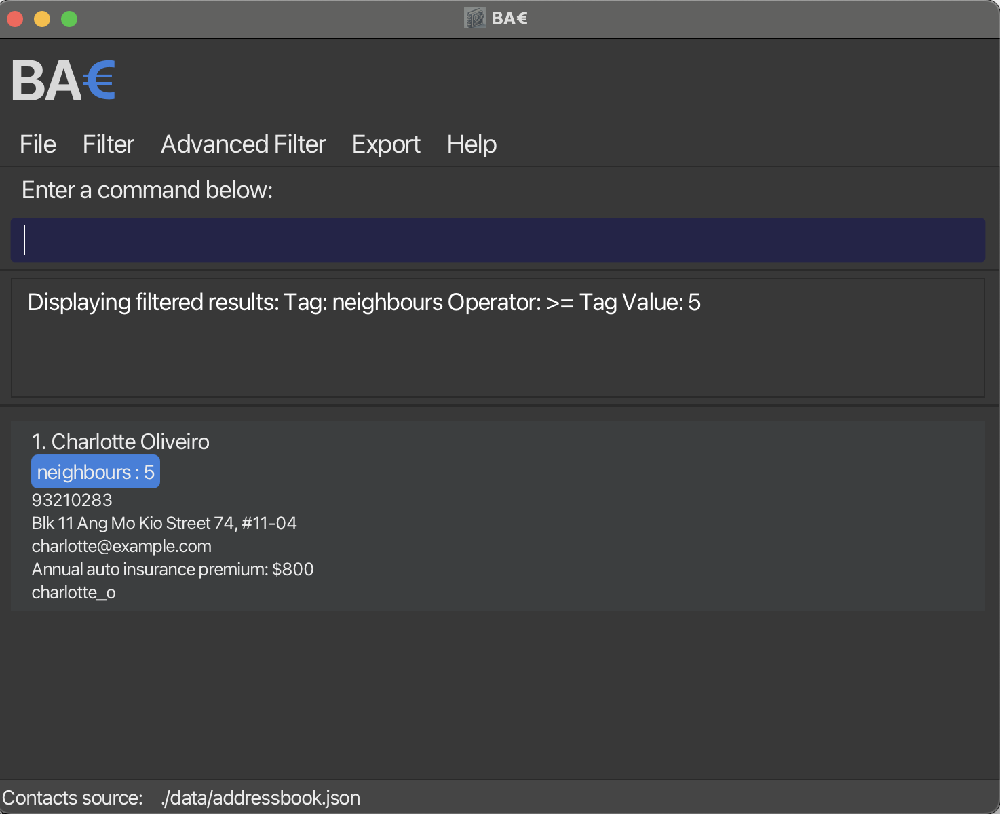

# BA€ User Guide

BA€ is a desktop app for managing contacts, optimized for use via a **Command Line Interface** (CLI) while still having the benefits of a **Graphical User Interface** (GUI). If you can type fast, BA€ can get your contact management tasks done faster than traditional GUI apps.

<!-- * Table of Contents -->
<page-nav-print />

--------------------------------------------------------------------------------------------------------------------

## Quick start

### Installation

1. Ensure Java `17` or above installed on your computer. If not you can download it from [here](https://www.oracle.com/java/technologies/downloads/#java17-windows).                                            

1. Download the latest `.jar` file from [here](https://github.com/AY2425S1-CS2103T-W14-2/tp/releases).

1. Copy the file to the folder you want to use as the _home folder_ for BA€.

### Launching BA€

1. **Open Your Command Terminal** 
   - Navigate to the folder where you saved the `.jar` file using the `cd` command.
   - For more info on how to use the `cd` command, visit the following links:
     - For [Windows users](https://www.wikihow.com/Change-Directories-in-Command-Prompt)
     - For [Mac/Linux users](https://iboysoft.com/wiki/cd-mac-terminal.html)
1. **Start the App**
   - Enter the following command: `java -jar tp.jar`
   - Within a few seconds, the BA€ Address Book interface should display and should look something like this:
   

### Using BA€

1. To get started, try entering some of these commands in the command box at the top of the app:

   * `help` : Opens the help menu detailing each command with an example format.

   * `add n\John Doe p\98765432 e\johnd@example.com a\3, 6th Ave fi\millionaire s\@jdoe` : Adds a contact named `John Doe` to the Address Book.

   * `list` : Lists all contacts.

   * `delete 3` : Deletes the 3rd contact shown in the current list.

   * `clear` : Deletes all contacts.

   * `exit` : Exits the app.

1. For more details on each command, refer to the [Features](#features) section below.

--------------------------------------------------------------------------------------------------------------------

## Features

<box type="info" seamless>

**Notes about the command format:** 

* Words in `UPPER_CASE` are the parameters to be supplied by the user. 
  e.g. in `add n\NAME`, `NAME` is a parameter which can be used as `add n\\John Doe`.

* Items in square brackets are optional. 
  e.g `n\NAME [t\TAG]` can be used as `n\John Doe t\friend` or as `n\John Doe`.

* Items with `…`​ after them can be used multiple times including zero times. 
  e.g. `[t\TAG]…​` can be used as ` ` (i.e. 0 times), `t\friend`, `t\friend t\family` etc.

* Parameters can be in any order. 
  e.g. if the command specifies `n\NAME p\PHONE_NUMBER`, `p\PHONE_NUMBER n\NAME` is also acceptable.

* Extraneous parameters for commands that do not take in parameters (such as `help`, `list`, `exit` and `clear`) will be ignored. 
  e.g. if the command specifies `help 123`, it will be interpreted as `help`.

* If you are using a PDF version of this document, be careful when copying and pasting commands that span multiple lines as space characters surrounding line-breaks may be omitted when copied over to the application.
</box>

### Viewing help : `help`

Shows a window showing all commands and usage examples.

Format: `help`

### Adding a person: `add`

Adds a person to the address book.

Format: `add n\NAME p\PHONE_NUMBER e\EMAIL a\ADDRESS fi\FINANCIALINFO s\SOCIALMEDIAHANDLE [t\TAG] [t\TAG:value]…​`

<box type="tip" seamless>

**Tip:** A person can have any number of tags (including 0). 
A tag can be added with or without a value. For example, `t\client` and `t\insurance:No` are both valid tags.
</box>

<box type="warning" seamless>
**Tag constraints:** 
* Only alphanumeric characters (alphabets and numbers) are supported in tags 
* Multiple of the same tags are not supported for a single contact 
* Negative numbers are not supported in tag values 
* Operations such as `+, -, *, /` are also not supported in tag values 
</box>

Command examples:
* `add n\John Doe p\98765432 e\johnd@example.com a\123 John street fi\millionaire s\@jon3 t\client t\priority:high`
* `add n\Betsy Crowe t\friend e\betsycrowe@example.com a\Newgate Prison p\1234567 t\criminal fi\noIncome s\@bestyC`

### Listing all persons : `list`

Shows a list of all persons in the address book.

Format: `list`

### Editing a person : `edit`

Edits an existing person in the address book.

Format: `edit INDEX [n\NAME] [p\PHONE] [e\EMAIL] [a\ADDRESS] [t\TAG]…​`

* Edits the person at the specified `INDEX`. The index refers to the index number shown in the displayed person list. The index **must be a positive integer** 1, 2, 3, …​
* At least one of the optional fields must be provided.
* Existing values will be updated to the input values.
* When editing tags, the existing tags of the person will be removed i.e adding of tags is not cumulative.
* You can remove all the person’s tags by typing `t/` without
    specifying any tags after it.

Examples:
*  `edit 1 p\91234567 e\johndoe@example.com` Edits the phone number and email address of the 1st person to be `91234567` and `johndoe@example.com` respectively.
*  `edit 2 n\Betsy Crower t\ ` Edits the name of the 2nd person to be `Betsy Crower` and clears all existing tags.

### Locating persons by name: `find`

Finds persons whose names contain any of the given keywords.

Format: `find KEYWORD [MORE_KEYWORDS]`

* The search is case-insensitive. e.g `hans` will match `Hans`
* The order of the keywords does not matter. e.g. `Hans Bo` will match `Bo Hans`
* Only the name is searched.
* Only full words will be matched e.g. `Han` will not match `Hans`
* Persons matching at least one keyword will be returned (i.e. `OR` search).
  e.g. `Hans Bo` will return `Hans Gruber`, `Bo Yang`

Examples:
* `find John` returns `john` and `John Doe`
* `find alex david` returns `Alex Yeoh`, `David Li` 
  

### Deleting a person : `delete`

Deletes the specified person from the address book.

Format: `delete INDEX`

* Deletes the person at the specified `INDEX`.
* The index refers to the index number shown in the displayed person list.
* The index **must be a positive integer** 1, 2, 3, …​

Examples:
* `list` followed by `delete 2` deletes the 2nd person in the address book.
* `find Betsy` followed by `delete 1` deletes the 1st person in the results of the `find` command.

### Filtering contacts: `filter`

Filters the contact list by name and/or tags.

Format: `filter [n\NAME] [t\TAG]…​`

* Filters the contact list by name and/or tags.
* n\NAME specifies a name (or partial name) to filter by.
* t\TAG specifies a tag to filter by. You can provide multiple tags.
* If both n\NAME and t\TAG are provided, the command will display contacts matching both the name and tags.
* If no parameters are provided, the full list is displayed.

Examples:
* filter `n\John` filters and displays all contacts whose names contain "John".
* filter `t\client` filters and displays all contacts tagged as "client".
* filter `n\John t\friend t\coworker` filters and displays contacts whose name contains "John" and who are tagged as both "friend" and "coworker".
* filter `n\Jo n\Al t\worth` filters and displays contacts whose name contains "Jo" or "Al" and tagged as "worth"
  

<box type="tip" seamless>

**Tip:** Use the command buttons provided to get command template

    

</box>

### Advanced filtering of your contacts: `advfilter`

Filters contacts by tag values, with an operator.
Format: `advfilter [t\TAG] [operator] [value]`
* Filters the contact list by tags values, comparing with the operator.
* Available operators include: `=, !=, <, <=, >, >=`

Examples:
* `advfilter t\premium > 1000` would show all contacts that have the tag of premium, and a value of more than 1000 for that tag
* `advfilter t\client != VIP` would show all contacts that have the tag of client, other than those with the value of VIP
* `advfilter t\highPriority = Yes` would show all contacts that have the tag of highPriority and the value of Yes.
* `advfilter t\neighbours >= 5` would show all contacts that have the tag of neighbours and a value of 5 or greater.
  

<box type="tip" seamless>

**Tip:** Use the command button for Advanced Filter provided to get command template

    

</box>

### Clearing all entries : `clear`

Clears all entries from the address book.

Format: `clear`

### Exiting the program : `exit`

Exits the program.

Format: `exit`

### Saving the data

AddressBook data are saved in the hard disk automatically after any command that changes the data. There is no need to save manually.

### Editing the data file

AddressBook data are saved automatically as a JSON file `[JAR file location]/data/addressbook.json`. Advanced users are welcome to update data directly by editing that data file.

<box type="warning" seamless>

**Caution:**
If your changes to the data file makes its format invalid, AddressBook will discard all data and start with an empty data file at the next run.  Hence, it is recommended to take a backup of the file before editing it. 
Furthermore, certain edits can cause the AddressBook to behave in unexpected ways (e.g., if a value entered is outside the acceptable range). Therefore, edit the data file only if you are confident that you can update it correctly.
</box>

### Archiving data files `[coming in v2.0]`

_Details coming soon ..._

--------------------------------------------------------------------------------------------------------------------

## FAQ

**Q**: How do I transfer my data to another Computer? 
**A**: Install the app in the other computer and overwrite the empty data file it creates with the file that contains the data of your previous AddressBook home folder.
**Q**: How do I use the data in another application, such as Microsoft Excel? 
**A**: Type in the command `export format\csv` or click on the Export button followed by CSV. Then, from the folder in which you installed BA€, navigate to the data folder, copy the file named `addressbook.csv` over to your desired file location. Finally, open the file using Microsoft Excel.

--------------------------------------------------------------------------------------------------------------------

## Known issues

1. **When using multiple screens**, if you move the application to a secondary screen, and later switch to using only the primary screen, the GUI will open off-screen. The remedy is to delete the `preferences.json` file created by the application before running the application again.
2. **If you minimize the Help Window** and then run the `help` command (or use the `Help` menu, or the keyboard shortcut `F1`) again, the original Help Window will remain minimized, and no new Help Window will appear. The remedy is to manually restore the minimized Help Window.
3. **If you accidentally press the alt key (Windows, Linux) or option key (MacOS)** on your keyboard while typing a command, the arrow keys will no longer navigate the command box. To rectify this, press the alt/option key again.
3. **If you add very long names, tags, or other information** (> 80 characters) to contacts, and the application window is not wide enough to display the entire line of text, the text will be truncated with `...` at the end.
4. **If you want to add tags to an existing contact**, you need to type in all existing tags to retain them.
5. **Advfilter does not accept mathematical expressions as values**. Mathematical expressions encompass any non-alphanumeric strings that include operators such as `+`, `-`, `/`, and `*`. Hence, commands such as `advfilter t\neighbours >= 10/3` will be considered invalid.

--------------------------------------------------------------------------------------------------------------------

## Command summary

Action     | Format, Examples
-----------|----------------------------------------------------------------------------------------------------------------------------------------------------------------------
**Add**    | `add n\NAME p\PHONE_NUMBER e\EMAIL a\ADDRESS fi\FINANCIALINFO s\SOCIALMEDIAHANDLE [t\TAG]…​`   e.g., `add n\James Ho p\22224444 e\jamesho@example.com a\123, Clementi Rd, 1234665 t\friend t\colleague`
**Clear**  | `clear`
**Delete** | `delete INDEX`  e.g., `delete 3`
**Edit**   | `edit INDEX [n\NAME] [p\PHONE_NUMBER] [e\EMAIL] [a\ADDRESS] [t\TAG]…​`  e.g.,`edit 2 n\James Lee e\jameslee@example.com`
**Find**   | `find KEYWORD [MORE_KEYWORDS]`  e.g., `find James Jake`
**List**   | `list`
**Help**   | `help`
**Filter** | `filter [n\NAME] [t\TAG]…​`  e.g., `filter n\John t\client t\friend`
**Advanced Filter** | `advfilter [t\TAG] [operator] [value]…​`  e.g., `advfilter t\premium > 1000`
